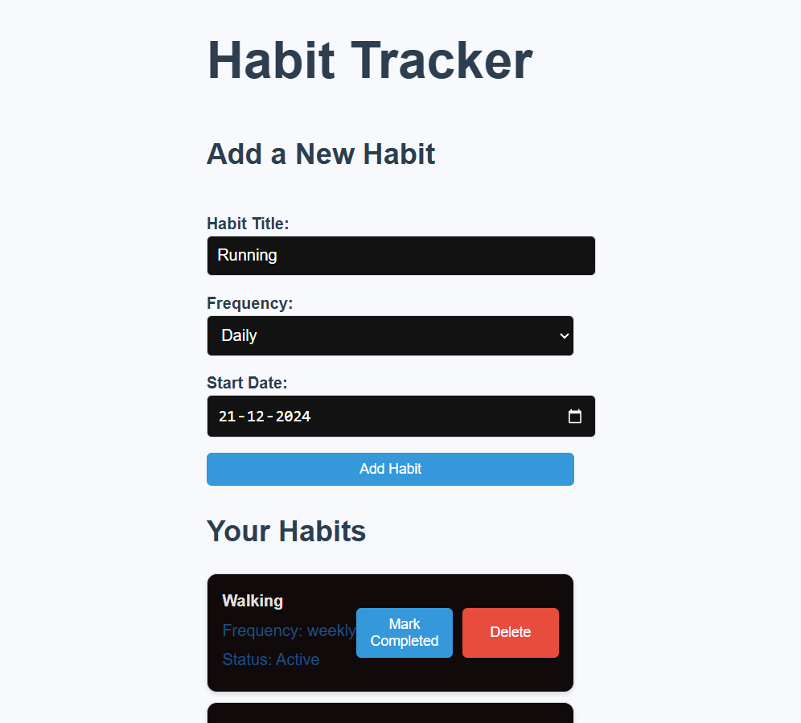
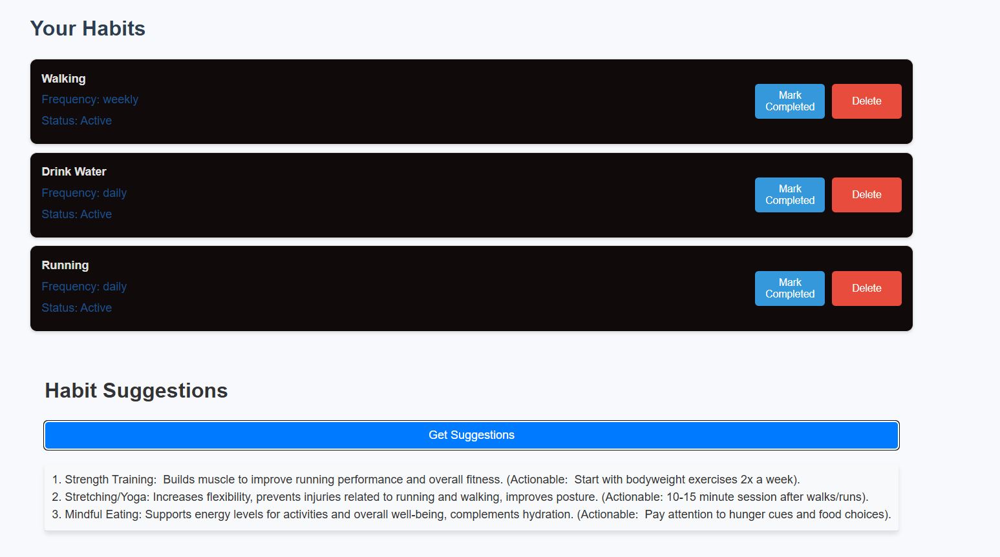
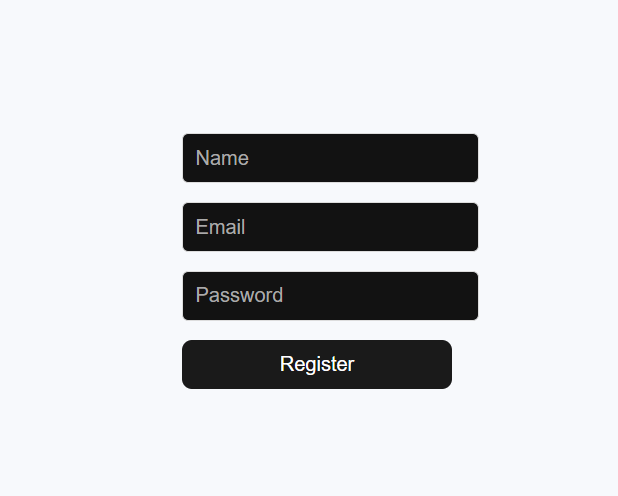
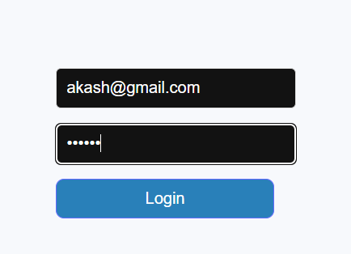

The Habit Tracker is a web application designed to help users build and maintain habits. It allows users to create habits, track their progress, and receive AI-powered suggestions for new habits

Setup Instructions

# Habit Tracker Project

## Overview
The Habit Tracker is a web application designed to help users build and maintain habits. It allows users to create habits, track their progress, and receive AI-powered suggestions for new habits.

---

## Features
- Add, update, and delete habits.
- Track daily, weekly, or custom frequencies for habits.
- AI-powered habit suggestions.
- API integration with backend services.

---

## Setup Instructions

### Backend Setup
1. Navigate to the backend folder:
   
   cd Backend
  
2. Install dependencies:
   
   npm install
  
3. Start the backend server:
   
   node server.js
  
   The backend will run on `http://localhost:5000` by default.

### AI Service Setup
1. Navigate to the AI-Service folder:
   
   cd AI-Service
  
2. Create a virtual environment:
   
   python -m venv .venv
  
3. Activate the virtual environment:
   - **Windows**:
     
     .venv\Scripts\activate
    
    
4. Install dependencies:
   
   pip install -r requirements.txt
  
5. Start the AI service:
   
   python app.py
   The AI service will run on `http://127.0.0.1:5000` by default.

### Frontend Setup
1. Navigate to the frontend folder:
   
   cd Frontend
2. Install dependencies:
   
   npm install
3. Start the frontend application:
   
   npm run dev
   The frontend will run on `http://localhost:5173` by default.

---

## API Documentation

Endpoints
1. User Registration
POST /api/register

Registers a new user.

Request Body
json
Copy code
{
  "name": "John Doe",
  "email": "john@example.com",
  "password": "securepassword"
}
Response
201: User registered successfully.
500: Error registering user.

2. User Login
POST /api/login

Authenticates a user and provides a JWT token.

Request Body
json
Copy code
{
  "email": "john@example.com",
  "password": "securepassword"
}
Response
200: Returns a JWT token.
json
Copy code
{
  "token": "your-jwt-token"
}
404: User not found.
403: Invalid credentials.

3. Get Habits
GET /api/habits

Fetches the list of habits for the authenticated user.

Headers
Authorization: Bearer <token>
Response
200: Returns an array of habits.
json
Copy code
[
  {
    "id": 1,
    "habit_title": "Drink Water",
    "frequency": "daily",
    "start_date": "2023-12-01",
    "status": "Active"
  }
]
500: Error fetching habits.

4. Create Habit
POST /api/habits

Creates a new habit for the authenticated user.

Headers
Authorization: Bearer <token>
Request Body
json
Copy code
{
  "habit_title": "Exercise",
  "frequency": "weekly",
  "start_date": "2023-12-01"
}
Response
201: Habit created successfully.
500: Error creating habit.

5. Update Habit
PUT /api/habits/:id

Updates the status of a habit for the authenticated user.

Headers
Authorization: Bearer <token>
Request Body
json
Copy code
{
  "status": "Completed"
}
Response
200: Habit updated successfully.
500: Error updating habit.

6. Delete Habit
DELETE /api/habits/:id

Deletes a habit for the authenticated user.

Headers
Authorization: Bearer <token>
Response
200: Habit deleted successfully.
500: Error deleting habit.

7. Get AI Suggestions
GET /api/ai-suggestions

Generates habit suggestions based on the user's existing habits.

Headers
Authorization: Bearer <token>
Response
200: Returns AI-generated suggestions.
json
Copy code
{
  "suggestions": [
    "Start journaling",
    "Try yoga",
    "Practice gratitude"
  ]
}
400: No habits found for the user.
500: Failed to fetch suggestions.

